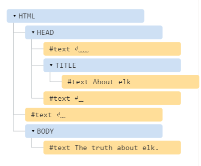

# DOM树
HTML文档的主干是标签(tag)
根据文档对象模型(DOM),每个HTML标签都是对象。全套的标签是闭合标签的子标签。标签内的文本也是一个对象。
所有这些对象都可以同JavaScript来访问，我们可以使用它们来修改页面。
例如， `document.body`时表示 `<body>` 标签的对象。 

## DOM的例子 
```html
<!DOCTYPE HTML>
<html>
<head>
  <title>About elk</title>
</head>
<body>
  The truth about elk.
</body>
</html>
```

DOM 将 HTML表示为标签的树形结构。如图：

每个树的节点都是一个对象。
标签被称为 **元素节点** (或者仅仅是元素)，并形成了树状结构: `<html>` 和 `<body>` 是其子项。
元素内的文本形成的 **文本节点**，被标记为 `#text`。一个文本节点只包含一个字符串。它没有子项，并且总是树的叶子。

注意文本节点中的特殊字符：
- 换行符 \n
- 空格

空格和换行符都是完全有效的字符，就像字母和数字。

**HTML中的所有内容，甚至注释，都会成为DOM的一部分**

甚至HTML开头的 `<!DOCTYPE...>` 指令也是一个DOM节点。它在DOM树中位于 `<html>` 前。
表示整个文档的 `document` 对象，在形式上也是一个DOM节点。

| 节点类型         |                                     |
| ---------------- | ----------------------------------- |
| 元素节点         | Node.ELEMENT_NODE(1)                |
| 属性节点         | Node.ATTRIBUTE_NODE(2)              |
| 文本节点         | Node.TEXT_NODE(3)                   |
| CDATA节点        | Node.CDATA_SECTION_NODE(4)          |
| 实体引用名称节点 | Node.ENTRY_REFERENCE_NOD E(5)       |
| 实体名称节点     | Node.ENTITY_NODE(6)                 |
| 处理指令节点     | Node.PROCESSING_INSTRUCTION_NODE(7) |
| 注释节点         | Node.COMMENT_NODE(8)                |
| 文档节点         | Node.DOCUMENT_NODE(9)               |
| 文档类型节点     | Node.DOCUMENT_TYPE_NODE(10)         |
| 文档片段节点     | Node.DOCUMENT_FRAGMENT_NODE(11)     |
| DTD声明节点      | Node.NOTATION_NODE(12)              |