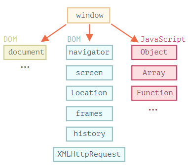

#浏览器环境

主机环境：
&ensp;主机环境提供了自己对象的语言核心以外的函数。Web浏览器提供了一种控制网页的方法。Node.js提供了服务器端功能。



- `Window`根对象。有两个角色：
1.首先，它是js代码的代码的全局对象。
2.其次，他代表“浏览器窗口”，并提供了控制它的方法。

例如，全局对象：
```javascript
function sayHi(){
    alert("Hello!")
}
window.sayHi();
```
在这里，我们将它用作浏览器窗口，已查看窗口高度。

```javascript
alert(window.innerHeight);
```

##文档对象模型(DOM)
文档对象模型简称DOM，将所有页面内容表示为可以修改的对象。

`document`对象是页面的主要入口点。可以用来更改或创建页面上的任何内容。
例如:
```javascript
document.body.style.background = "red";
setTimeout(()=>document.body.style.background = "",1000);
```

##浏览器对象模型(BOM)
浏览器对象模型简称BOM，表示由浏览器(主机环境)提供的用于处理文档之外的所有内容的其他对象。
例如：
- `navigator` 对象提供了有关浏览器和操作系统的背景信息。navigator有许多属性，但是最广为人知的两个属性是 `navigator.userAgent` ——关于当前浏览器，`navigator.platform` ——关于当前平台(可以区分Windows/Linux/Mac)。
- `localtion` 对象允许我们读取当前URL，并且可以将浏览器重定向到新的URL。