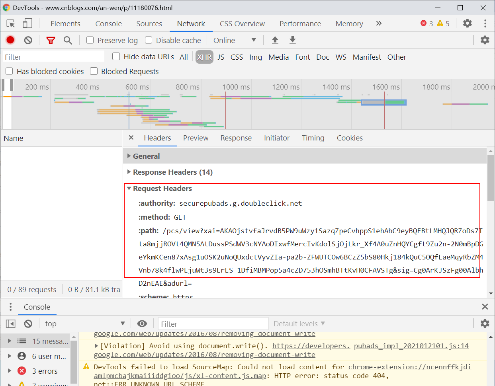
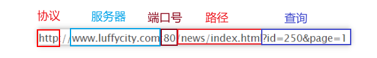
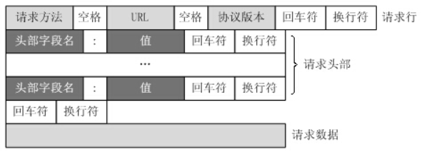
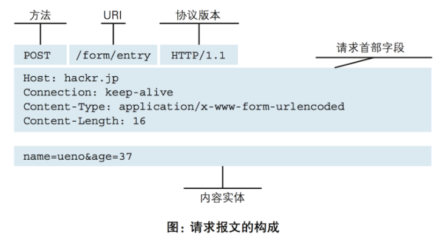

# HTTP
HTTP 是一个 `client`(客户端-用户) 和 `server`(服务端-网站)请求和应答的标准

## HTTP请求步骤
1.  客户端连接到服务器
    一个HTTP客户端，通常是浏览器，与Web客户端的HTTP端口建立一个TCP套接字连接字。
2.  发送HTTP请求
    通过TCP套接字，客户端向Web服务器发送一个文本的请求报文，一个请求报文由请求行、请求头部(requset head)、空行和请求数据4部分组成
    
3.  服务器接受请求并返回HTTP响应
    Web服务器解析请求，定位请求资源。服务器将资源副本写到TCP套接字，由客户端读取。一个响应由状态行、响应头部、空行和响应数据4部分组成。
4.  释放连接TCP连接
    若 connection 模式为close,则服务器主动关闭TCP连接，客户端被动关闭连接，释放TCP连接;若 connection 模式为keepalive，则该连接会保持一段时间，在该时间内可以继续接受请求。
5.  客户端浏览器解析HTML内容
    客户端浏览器首先解析状态行，查看表明请求是否成功的状态代码。然后解析每一个响应头，响应头告知以下为若干字节的HTML文档和文档的字符集。客户端浏览器读取响应数据HTML，根据HTML的语法对其进行格式化，并在浏览器窗口中显示。

例如：输入URL并按下回车后：
1.  浏览器向DNS服务器请求解析该URL中的域名所对应的IP地址;
2.  解析出IP地址后，根据该IP地址和默认端口80，和服务器建立TCP连接；
3.  浏览器发出读取文件（URL中域名后面对应部分文件）的HTTP请求，该请求报文作为TCP三次握手的第三个报文的数据发送给服务器；
4.  服务器对浏览器请求作出响应，并把对应的HTML文本发送给浏览器；
5.  释放TCP连接；
6.  浏览器将该HTML文本显示内容

**HTTP协议是基于TCP/IP协议之上的应用层协议。**
**基于请求-响应的模式**
请求必定由客户端发出，而服务器端回复响应
**无状态保存**
HTTP协议本身不具备保存之前发送过的请求或响应的功能
**无连接**
无连接的含义是限制每次连接只处理一个请求。服务器处理完客户的请求，并收到客户的应答后，即断开连接。早期直接断开，现在回等几秒。

## HTTP请求方式
`GET`
向指定资源发出显示请求。`GET` 方法只用在读取数据，而不应当被用于产生"副作用"的操作中。
`HEAD`
与 `GET` 方法一样，都是向服务器发出指定资源的请求。只不过服务器将不传回资源的本文部分。
`POST`
向指定资源提交数据，请求服务器进行处理。数据被包含在请求本文中。
`PUT`
向指定资源位置上传其最新内容。
`DELETE`
请求服务器删除Request-RUL所标识的资源。
`TRACE`
回显服务器收到的请求，主要用于测试或诊断。
`OPTIONS`
使服务器传回该资源所支持的所有HTTP请求方法。
`CONNECT`
用于SSL加密服务器的链接。

## HTTP状态码
所有HTTP响应的第一行都是状态行，依次是当前HTTP版本号，3位数字组成的状态代码，以及描述状态的短语。

状态代码的第一个数字代表当前响应的类型：
* 1xx消息--请求已被服务器成功接受，继续处理
* 2xx成功--请求已成功服务器接收、理解、并接受
* 3xx重定向--需要后续操作才能完成这一请求
* 4xx请求错误--请求含有语法错误或者无法被执行
* 5xx服务器错误--服务器在处理某个正确请求时发生错误

# URL
HTTP的统一资源定位符将获取到的信息的五个基本元素包括在一个简单的地址中：
*  传输协议
*  层级URL标记符号(为[/ /]，固定不变)
*  访问资源所需的凭证信息(可省略)
*  服务器(通常为域名，有时为IP地址)
*  端口号(以数字方式表示，若为HTTP的默认值"：80"可省略)
*  路径(以"/"字符区别路径中的每一个目录名称)
*  查询(GET模式的窗体参数，以"?"字符为起点，每个参数以"&"隔开，再以"="分开参数名称与数据，通常以UTF-8的URL编码，避开字符冲突问题)
*  片段(以"#"字符为起点)

# HTTP请求格式

